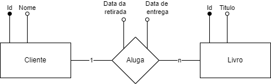

# Capítulo 1 - Planejamento e implementação do banco de dados

Nesse projeto vamos usar o SGBD __Postres__ como o nosso banco de dados. Vamos implementar um sistema simples de
biblioteca, onde será possível um cliente alugar 1 ou mais livros.

### Planejamento
Vamos usar um diagrama de entidade/relação para visualizar melhor o problema. Temos que entender que:
> Um livro não pode estar alugado mais de uma vez simultaneamente.
 
> Um livro pode não estar alugado.
  
> Um cliente pode alugar vários livros simultaneamente
 
> Deve ser registrado a data do aluguel e a data para ser entregue.

### Diagrama
Observe que os retângulos representam entidades, e os losângo relações. Das figuras saem linhas com círculos
no fim. Essas linhas são própriedades. Se o círculo for preenchido ele representa uma chave primária, que é um
identificador único para uma instância da entidade.

### Modelagem Relacional

Vemos que temos uma relação de um para muitos. Pois, 1 cliente pode alugar de 0 até n livros. Para esses
casos utilizamos uma tabela para representar a relação no banco de dados.

__Cliente (<ins>id</ins>, nome)__

__Livro (<ins>id</ins>, titulo)__

__Aluga (<ins>cliente_id</ins>, <ins>livro_id</ins>, data_retirada, data_entrega)__

Os itens que estão sublinhados representando as chaves primárias. A tabela __aluga__ possui uma chave composta
que é o uso de duas propriedades como chave primária.

Além disso, a tabela __aluga__ possui duas chaves estrangeiras, que são propriedade que apontam para algum item de
outra tabela. No caso, "cliente_id" aponta para uma linha na tabela "cliente", e "livro_id" aponta para um item na
tabela livro.

### Implementação
Você pode escrever o seu próprio código sql ou usar o que está nesta pasta.

    CREATE TABLE client (
        "id" SERIAL PRIMARY KEY,
        "name" TEXT NOT NULL
    );

    CREATE TABLE book (
        "id" SERIAL PRIMARY KEY,
        "title" TEXT NOT NULL
    );

    CREATE TABLE client_books (
        "client_id" INTEGER NOT NULL,
        "book_id" INTEGER NOT NULL,
        "start_date" TIMESTAMP DEFAULT NOW(),
        "end_date" TIMESTAMP DEFAULT NOW() - INTERVAL '-30 DAY',
        PRIMARY KEY (client_id, book_id),
        FOREIGN KEY (client_id) REFERENCES client("id"),
        FOREIGN KEY (book_id) REFERENCES book("id")
    );

No meu caso, eu criei um novo banco de dados chamado ___library___ no postgres por meio do PgAdmin4
e executei esse código para criar as tabelas.
